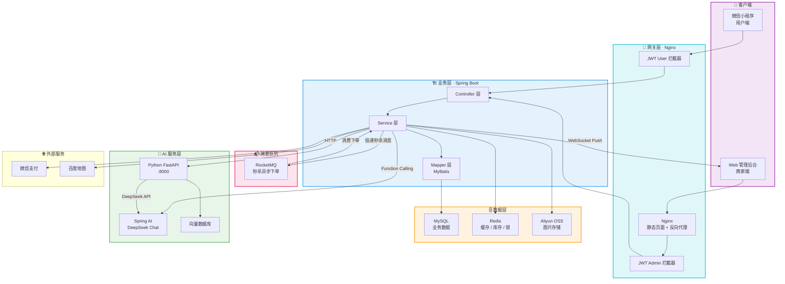
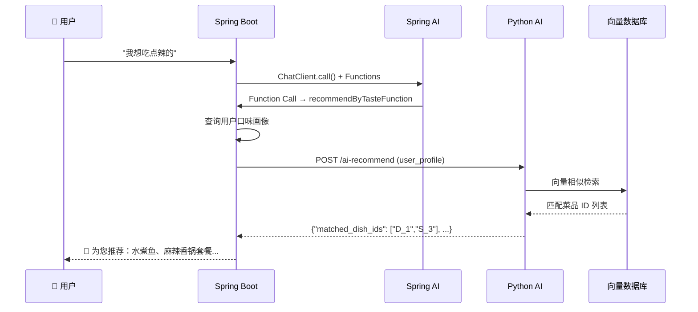

# 🚀 苍穹外卖 · AI 智联版

<div align="center">


**智慧外卖管理系统 · AI 赋能餐饮新范式**

</div>

---

## 📖 项目概览

> **苍穹外卖** 是一个基于 Spring Boot 3.2 构建的全栈智慧外卖管理平台，深度融合 **AI 大模型能力**，为餐饮商家提供从订单管理、智能客服、个性化推荐到经营诊断的全链路数字化解决方案。

与传统的"增删改查"外卖系统不同，本项目在经典外卖业务之上搭建了一套完整的 **AI 智联架构**——通过 Spring AI + Python AI 服务的双引擎协作，实现了 AI 客服 Function Calling、用户口味画像建模、向量化菜品匹配、评价智能润色、差评经营诊断等前沿能力，让外卖 SaaS 真正迈入"AI 驱动经营"的时代。

> 项目采用前后端分离架构，管理端 (`/admin/**`) 与用户端 (`/user/**`) 双体系 JWT 鉴权，支持微信支付、WebSocket 实时推送、秒杀高并发等核心业务场景。

---

## 💡 核心亮点

### 🧠 AI 经营诊断 —— 差评分析与经营建议

> *"不只是看数据，而是让 AI 帮你读懂数据背后的故事。"*

通过 **Python Agent** 联调引擎，系统自动聚合近期低分评价，进行语义级别的聚类和归因分析：

- 🔍 **差评归因**：自动识别菜品口味、配送速度、包装质量等高频投诉维度
- 📊 **趋势洞察**：对比周期内的评价变化，发现潜在经营风险点
- 💡 **可执行建议**：生成自然语言形式的改进方案，直接推送到管理后台面板

```
Java (评价数据聚合) → HTTP → Python AI Agent → 语义分析 → 经营诊断报告
```

### ✨ AI 智回评价 —— 评价智能润色

> *"AI 帮你把每一条回复都写得恰到好处。"*

- **用户提交评价** → 先入库秒级响应 → `CompletableFuture` 异步调用 AI 润色 → 后台回填 `ai_optimized` 字段
- **商家回复辅助**：管理端可查看 AI 润色建议，辅助商家撰写回复
- **柔性降级**：AI 服务不可用时原评论不受影响，保证核心链路稳定性

### 🍜 AI 口味推荐 —— 千人千面的菜品引擎

> *"比用户更懂用户的口味。"*

这是一个完整的 **冷启动 → 画像建模 → 向量召回 → 个性化推荐** 闭环：

| 阶段 | 能力 | 说明 |
|------|------|------|
| 🏷️ 标签提取 | AI 口味标签 | Python 服务为每道菜品/套餐提取口味特征标签 |
| 🗄️ 向量入库 | 向量化存储 | 菜品标签同步至向量数据库，支持语义相似检索 |
| 👤 画像建模 | 用户口味画像 | 基于历史订单，AI 生成用户口味摘要并持续动态更新 |
| 🎯 智能推荐 | 向量匹配召回 | AI 匹配用户画像与菜品向量，精准推荐 |
| 🛡️ 冷启动 | 销量排行榜兜底 | 新用户无画像时，自动降级到 Top5 人气销量王 |

### ⚡ 高性能秒杀 —— RocketMQ 异步削峰 + Redis 预扣库存

> *"高并发下的一人一单，稳如磐石。"*

秒杀链路采用 **RocketMQ 异步削峰** 架构，将"抢购"与"下单"解耦，大幅缩短用户响应时间：

```
用户抢购 → Redis 预扣库存(1ms) → 投递 MQ → 立即返回"排队中"
                                              ↓
                                    Consumer 异步消费 → DB 扣库存 → 创建订单 → WebSocket 推送
```

- **Redisson 分布式锁**：商品级细粒度锁，仅包裹 Redis 原子操作（SETNX + DECR），锁持有时间从 ~200ms 降至 ~1ms
- **RocketMQ 异步削峰**：锁外投递消息，消费端异步入库，DB 写入削峰填谷
- **库存预热**：活动创建时自动将库存加载到 Redis，首次抢购无冷启动
- **一人一单防刷**：Redis 防重键 + 活动结束自动过期
- **消息可靠投递**：syncSend 超时回滚 Redis 库存，消费端幂等校验 + 失败补偿
- **容错设计**：DB 行级锁兜底防超卖（`WHERE stock > 0`），Redis/DB 库存极端不一致时自动关闸
- **WebSocket 实时来单提醒**：消费端入库成功 → 毫秒级推送到管理后台

### 📡 WebSocket 实时通信

- 管理端来单提醒（普通订单 + 秒杀订单）
- 用户催单实时推送
- 连接生命周期管理，自动清理离线的 Session

---

## 🛠️ 技术栈

### 后端核心

| 技术 | 版本 | 用途 |
|------|------|------|
| Spring Boot | 3.2.5 | 应用框架 |
| Java | 17 | 运行环境 |
| MyBatis | 3.0.3 | ORM 持久层 |
| Spring AI | 1.0.0-M6 | AI 大模型集成 (OpenAI-compatible) |
| Redisson | 3.27.0 | Redis 分布式锁 & 原子操作 |
| RocketMQ | 5.1.4 | 秒杀异步削峰 & 消息队列 |
| JWT (jjwt) | 0.12.5 | 无状态双端鉴权 |
| WebSocket (Jakarta) | — | 实时消息推送 |
| Knife4j (SpringDoc) | 4.5.0 | API 文档 & 调试 |
| Apache POI | 3.16 | 运营报表 Excel 导出 |

### AI 层

| 技术 | 用途 |
|------|------|
| DeepSeek API | 大语言模型 (通过 Spring AI OpenAI Starter 接入) |
| Python FastAPI | AI 微服务 (口味提取 / 向量同步 / 画像更新 / 推荐 / 润色 / 诊断) |
| 向量数据库 | 菜品语义索引 & 相似检索 |

### 中间件 & 基础设施

| 技术 | 用途 |
|------|------|
| MySQL 8.x | 主数据库 |
| Redis 7.x | 缓存 / 分布式锁 / 库存预热 / 防重 |
| RocketMQ 5.x | 秒杀异步削峰 / 消息队列 |
| Nginx | 反向代理 / 管理端静态页面托管 |
| Docker / Docker Compose | 容器化部署 / 依赖服务一键启动 |
| Druid | 数据库连接池 |
| Alibaba OSS | 菜品图片云存储 |
| 百度地图 API | 配送距离计算 |
| 微信支付 API v3 | 用户支付 & 退款 |

### 构建 & 工具

| 工具 | 说明 |
|------|------|
| Maven | 多模块项目管理 |
| Lombok | 样板代码精简 |
| PageHelper | 物理分页 |

---

## 📐 架构说明

### 系统架构图



### 模块划分

```
sky-take-out (父 POM)
├── sky-common    📦 公共模块：常量、枚举、异常、工具类、JWT、OSS、微信支付
├── sky-pojo      📦 数据对象：DTO、Entity、VO、Result 统一响应
└── sky-server    🚀 服务模块：Controller、Service、Mapper、Config、WebSocket、Task
```

### AI 交互时序



---

## 📸 功能预览

> ✨ **占位提醒**：以下区域预留用于放置功能截图。建议在项目运行时截取以下界面：

| 截图位置 | 建议内容 |
|----------|----------|
| 🖥️ 管理端工作台 | 今日营业数据概览、订单统计、销量排行 |
| 📋 订单管理 | 订单列表、状态流转、接单/拒单/派送操作 |
| 🤖 AI 客服对话 | 用户端聊天界面：查订单、菜品推荐、评价查询 |
| 🍜 AI 口味推荐 | 首页"猜你喜欢"个性化推荐卡片 |
| ⭐ 评价管理 | 用户提交评价 + AI 润色对比 + 商家回复 |
| ⚡ 秒杀活动 | 管理端创建秒杀 + 用户端限时抢购 + WebSocket 实时通知 |
| 📊 AI 经营诊断 | 差评聚合分析报告 + 改进建议面板 |
| 📄 API 文档 | Knife4j 接口文档调试页面 |

---

## 🛠️ 快速启动

### Docker 容器化部署（推荐）

项目已完整容器化，除 Java 后端外所有依赖服务均由 Docker Compose 管理。

**整体架构：**

```
┌──────────────────────────────────────────────────┐
│ Docker (必须)                                      │
│ ┌─────────┐ ┌──────────┐ ┌────────────────────┐  │
│ │ RocketMQ│ │Python AI │ │ Nginx              │  │
│ │ :9876   │ │ :8000    │ │ :80 → 反向代理后端  │  │
│ └─────────┘ └──────────┘ └────────────────────┘  │
└──────────────────────────────────────────────────┘
         ↑              ↑              ↑
    localhost       localhost      localhost

┌──────────────────────────────────────────────────┐
│ Windows 本机                                       │
│ ┌────────────────┐ ┌──────────┐ ┌─────────────┐  │
│ │ IDEA (Java后端)│ │ MySQL    │ │ Redis       │  │
│ │ :8080 断点调试  │ │ :3306   │ │ :6379       │  │
│ └────────────────┘ └──────────┘ └─────────────┘  │
└──────────────────────────────────────────────────┘
```

> **设计思路**：Java 后端保留在 IDEA 本地运行（断点调试 / 热部署），MySQL/Redis 用本机已有的（保留测试数据），RocketMQ/Python AI/Nginx 等本地难装的服务交给 Docker。

### 环境要求

| 依赖 | 版本要求 | 说明 |
|------|----------|------|
| JDK | 17+ | Spring Boot 3.x 最低要求 |
| Maven | 3.6+ | IDEA 自带即可 |
| MySQL | 8.0+ | 本地已有（保留测试数据） |
| Redis | 7.x | 本地已有（保留测试数据） |
| Docker Desktop | 最新版 | 必须，运行 RocketMQ / AI / Nginx |

### 1️⃣ 配置 Docker 镜像加速

由于 Docker Hub 在国内访问受限，**必须先配置镜像加速器**：

打开 Docker Desktop → Settings → Docker Engine，粘贴以下配置后点击 Apply & Restart：

```json
{
  "registry-mirrors": [
    "https://docker.m.daocloud.io",
    "https://docker.1ms.run",
    "https://docker.xuanyuan.me"
  ]
}
```

### 2️⃣ 启动依赖服务

```bash
cd D:\Code\SkyTakeout

# 方式一：一键脚本（推荐）
双击 dev-start.bat

# 方式二：命令行
docker compose up -d rocketmq-namesrv rocketmq-broker ai-service nginx
```

首次启动会拉取镜像（约 2-5 分钟），后续秒级启动。启动后访问：

| 服务 | 地址 |
|------|------|
| 🖥️ 管理端页面 | `http://localhost` |
| 🤖 AI 服务 | `http://localhost:8000` |

### 3️⃣ IDEA 启动 Java 后端

在 IDEA 中打开 `Backend` 目录，运行 `SkyApplication`（profile: `dev`）。

Java 连的是你本机的 MySQL(:3306) 和 Redis(:6379)，Docker 只补 RocketMQ 和 AI 服务。

> **为什么 Java 不在 Docker 里跑？** IDEA 断点调试、热部署、日志查看都比 Docker 方便太多。Docker 只托管本地难装的服务。

### 4️⃣ 关闭服务

```bash
# 方式一：一键脚本
双击 dev-stop.bat

# 方式二：命令行
docker compose stop rocketmq-broker ai-service nginx rocketmq-namesrv
```

### 5️⃣ 初始账号

| 角色 | 账号 | 密码 |
|------|------|------|
| 管理员 | `admin` | `123456` |
| 普通用户 | 微信小程序登录 | — |

---

## 📦 容器化说明

### 服务清单

| 服务 | 容器名 | 端口 | 镜像 |
|------|--------|:---:|------|
| RocketMQ NameServer | skytakeout-rmq-namesrv | 9876 | apache/rocketmq:5.1.4 |
| RocketMQ Broker | skytakeout-rmq-broker | 10911 | apache/rocketmq:5.1.4 |
| Nginx | skytakeout-nginx | 80 | nginx:alpine |
| Python AI | skytakeout-ai | 8000 | 自构建 (Ai_service/) |

### 不在 Docker 的服务（原因）

| 服务 | 原因 |
|------|------|
| Java 后端 | IDEA 本地跑，断点调试 & 热部署 |
| MySQL | 保留本地已有测试数据 |
| Redis | 保留本地已有测试数据 |

### Nginx 反向代理规则

```
浏览器请求 → Nginx(:80)
  ├─ /              → 管理端静态页面 (nginx/html/)
  ├─ /api/*         → host.docker.internal:8080/admin/* (IDEA 后端)
  ├─ /user/*        → host.docker.internal:8080/user/*
  └─ /ws/*          → host.docker.internal:8080/ws/*   (WebSocket)
```

### 管理端前端更新

管理端代码修改后，重新编译并复制到 Nginx 目录：

```bash
cd Frontend\project-sky-admin-vue-ts
npm run build
xcopy /E /Y dist\* D:\Code\SkyTakeout\Backend\nginx\html\
```

> **开发调试时**推荐直接 `npm run serve`（直连 `localhost:8080` 后端），不需要走 Nginx。

---

## 🔧 命令速查

```bash
# 查看所有容器状态
docker compose ps

# 查看某服务日志
docker logs -f skytakeout-rmq-broker
docker logs -f skytakeout-ai

# 重建并重启某服务（修改配置后）
docker compose up -d --force-recreate rocketmq-broker

# 彻底清理（删除容器+网络，不动 volume 数据）
docker compose down
```

---

## 🗂️ 项目统计

```
Modules:     3 (sky-common / sky-pojo / sky-server)
Entities:    12+ (菜品 / 套餐 / 订单 / 用户 / 评价 / 秒杀活动 / 购物车 / 地址簿 / ...)
API 端点:     35+ (管理端) + 25+ (用户端)
自定义异常:   10+ 业务异常类型
AI Functions: 6 (查订单 / 取消订单 / 推荐 / 搜菜 / 看评价 / 再来一单)
MQ Topics:    1 (seckill-order-topic — 秒杀异步下单)
定时任务:     2 (超时订单取消 每分钟 / 派送超时完成 每日凌晨)
Docker 服务:  4 (RocketMQ / Nginx / Python AI / RocketMQ Dashboard 可选)
```

---

## 🎯 设计理念

> **"AI 不是噱头，是实实在在的业务价值。"**

本项目坚持以下原则：

- 🛡️ **AI 柔性降级**：所有 AI 调用均设计降级策略——AI 不可用时核心业务不中断（口味推荐 → 销量排行榜，AI 润色 → 原评论入库）
- 🔒 **安全第一**：AOP 自动填充公共字段、JWT 双端隔离鉴权、分布式锁防超卖
- 🧩 **关注点分离**：`sky-common` 工具复用、`sky-pojo` 数据契约、`sky-server` 业务编排
- ⚡ **性能敏感**：Redis 缓存预热、PageHelper 物理分页、异步 CompletableFuture 处理非关键路径

---

## 📄 License

MIT License · Copyright (c) 2025

---

<div align="center">

**⭐ 如果这个项目对你有帮助，请点亮 Star 支持一下！**

</div>
